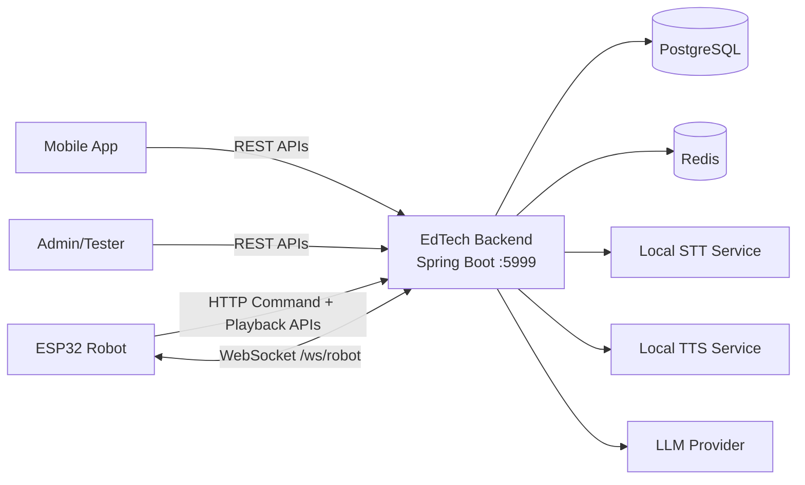
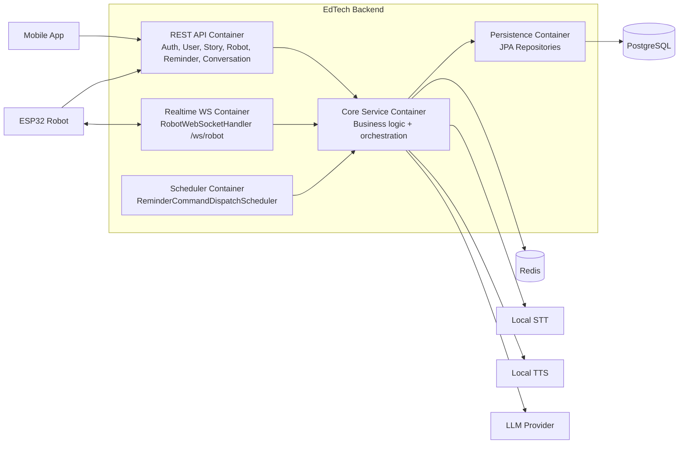

# Backend Overview (C4 Style)

## C4 - Context (Level 1)

```mermaid
flowchart LR
    Mobile[Mobile App]
    Robot[ESP32 Robot]
    Admin[Admin/Tester]

    Backend[EdTech Backend\nSpring Boot :5999]

    PG[(PostgreSQL)]
    Redis[(Redis)]
    STT[Local STT Service]
    TTS[Local TTS Service]
    LLM[LLM Provider]

    Mobile -->|REST APIs| Backend
    Admin -->|REST APIs| Backend
    Robot -->|HTTP Command + Playback APIs| Backend
    Robot <--> |WebSocket /ws/robot| Backend

    Backend --> PG
    Backend --> Redis
    Backend --> STT
    Backend --> TTS
    Backend --> LLM
```

## C4 - Container (Level 2)

```mermaid
flowchart LR
    Mobile[Mobile App]
    Robot[ESP32 Robot]

    subgraph Backend[EdTech Backend]
        API[REST API Container\nAuth, User, Story, Robot, Reminder, Conversation]
        WS[Realtime WS Container\nRobotWebSocketHandler /ws/robot]
        Core[Core Service Container\nBusiness logic + orchestration]
        Scheduler[Scheduler Container\nReminderCommandDispatchScheduler]
        Repo[Persistence Container\nJPA Repositories]
    end

    PG[(PostgreSQL)]
    Redis[(Redis)]
    STT[Local STT]
    TTS[Local TTS]
    LLM[LLM Provider]

    Mobile --> API
    Robot --> API
    Robot <--> WS

    API --> Core
    WS --> Core
    Scheduler --> Core
    Core --> Repo

    Repo --> PG
    Core --> Redis
    Core --> STT
    Core --> TTS
    Core --> LLM
```
