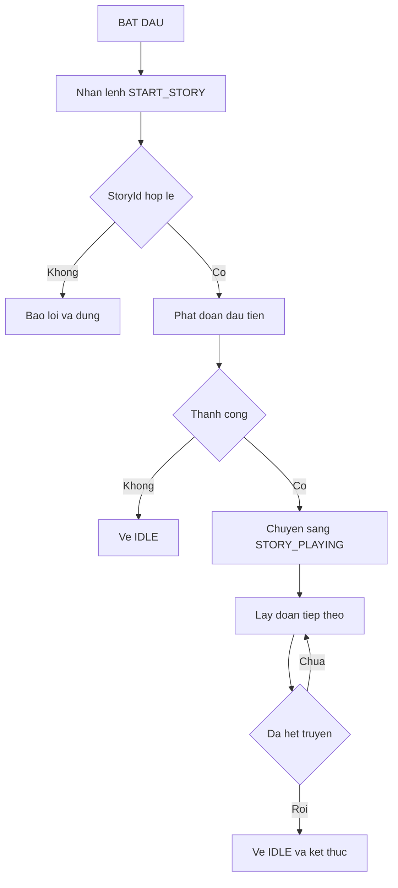
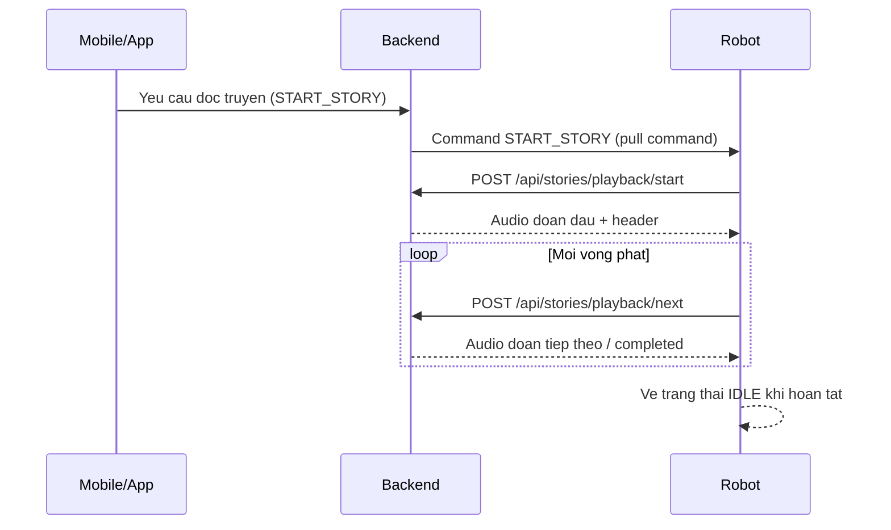
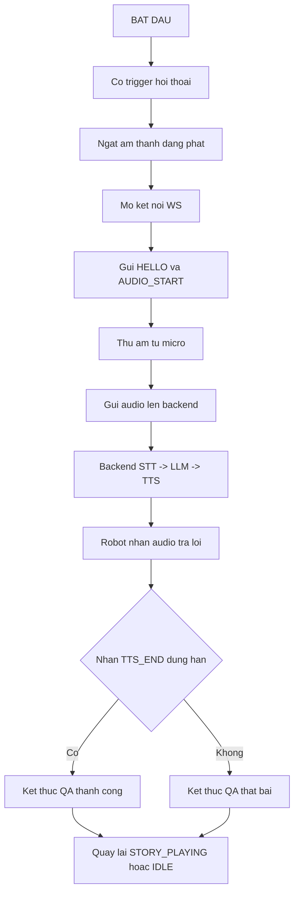
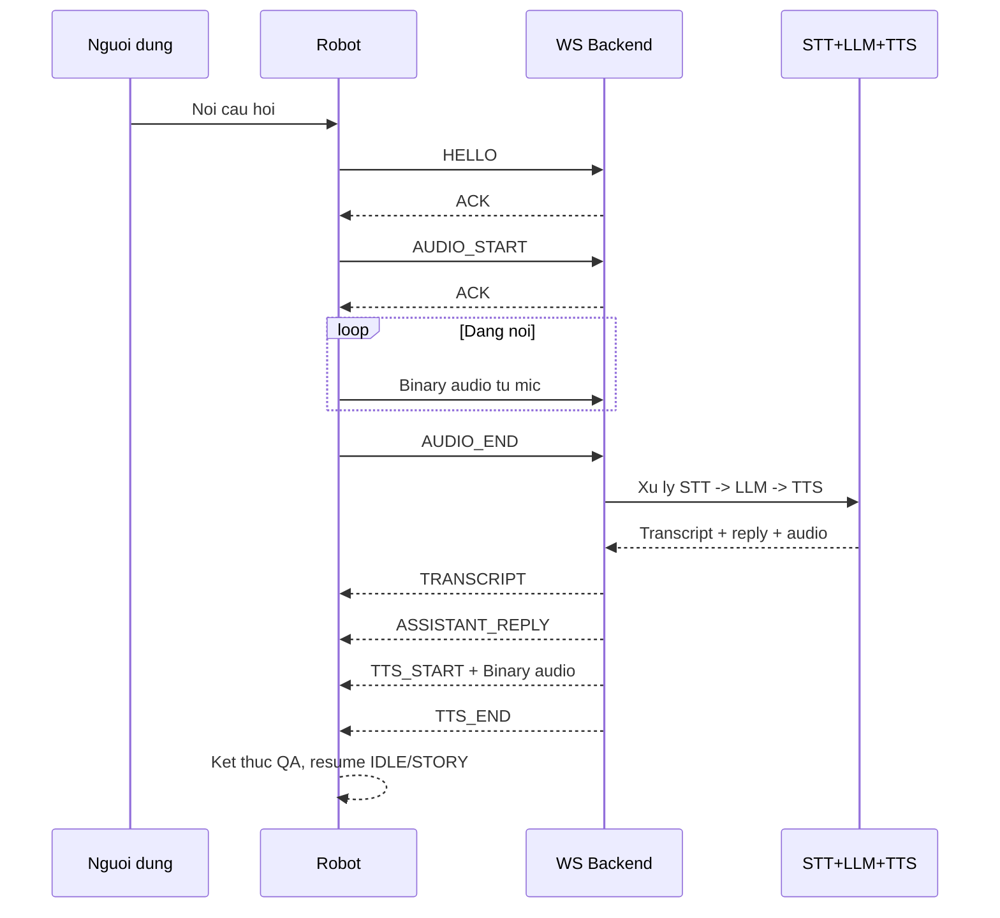
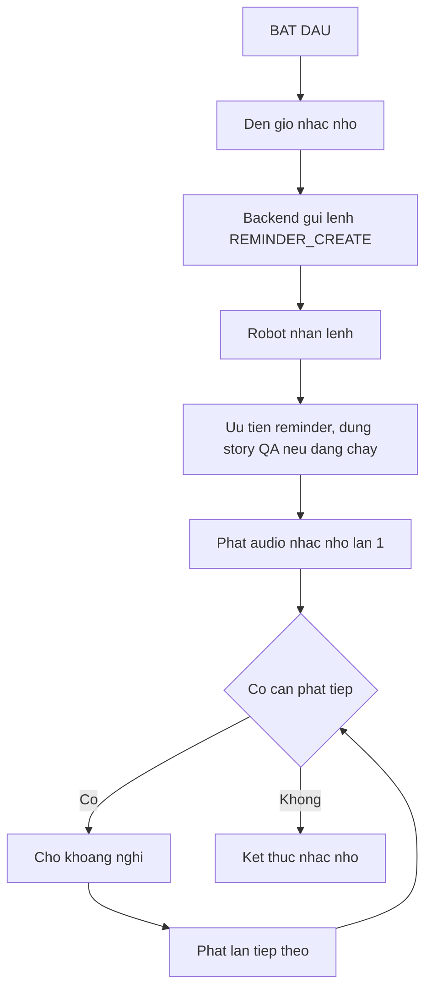
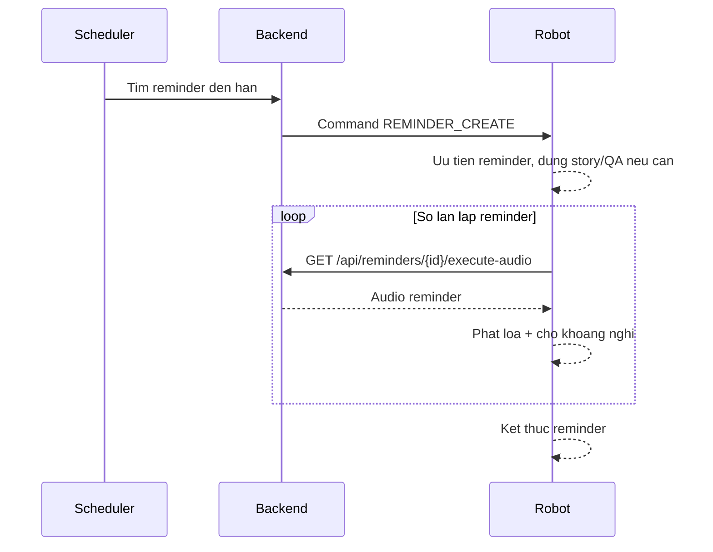

# Ghi Chu Chi Tiet 3 Luong Robot (Dang Chu + Step by Step)

Tai lieu nay mo ta chi tiet 3 luong chinh dang chay trong du an:
1) Robot doc truyen.
2) Robot hoi thoai voi nguoi binh thuong + QA theo ngu canh truyen.
3) Robot phat nhac nho.

---

## 1) Luong Robot Doc Truyen

### Muc tieu
- Robot nhan lenh `START_STORY`, phat audio truyen theo tung doan.
- Khi phat xong toan bo, robot tro ve `IDLE`.

### Dau vao chinh
- Command tu backend: `START_STORY` (co `storyId`).
- API playback:
- `POST /api/stories/playback/start`
- `POST /api/stories/playback/next`
- `POST /api/stories/playback/stop` (khi can dung).

### Step-by-step
1. Backend issue command `START_STORY` vao Redis stack command cua robot.
2. Firmware task nen poll `GET /api/robots/{robotId}/commands/pull?consume=true` lay command moi.
3. Khi gap `START_STORY`, firmware goi `onStartStory(storyId)`.
4. Firmware validate `storyId`:
- Neu rong -> log loi, hien thi loi, dung luong.
5. Firmware reset trang thai doc:
- `g_stopRequested=false`
- `g_currentStoryId=storyId`
- `g_storyCompleted=false`
6. Firmware goi `POST /api/stories/playback/start` de lay chunk audio dau tien.
7. Firmware parse response audio:
- HTTP `200`: co audio -> dua vao queue loa va phat.
- HTTP `204`: khong con audio (completed ngay).
- Header `X-Completed`, `X-Segment-Order`, `X-Sample-Rate`, `X-Channels` duoc dung de cap nhat trang thai.
8. Neu `start` that bai (`!res.ok`):
- Danh dau completed.
- Xoa `currentStory`.
- Chuyen `STATE_IDLE`.
9. Neu `start` bi ngat boi STOP hoac QA:
- Ket thuc nhanh luong start, khong vao vong next.
10. Neu start OK:
- Neu completed -> ve `IDLE`.
- Neu chua completed -> vao `STATE_STORY_PLAYING`.
11. Trong `loop()`, firmware goi `tickStoryPlayback()` theo chu ky.
12. Moi tick:
- Goi `POST /api/stories/playback/next` lay doan tiep theo.
- Neu fail tam thoi -> giu state, tick sau thu lai.
- Neu bi ngat boi STOP/QA -> thoat tick hien tai.
- Neu completed -> dat `STATE_IDLE`, xoa `currentStory`.
- Neu chua completed -> tiep tuc `STATE_STORY_PLAYING`.

### Diem quan trong
- Luong doc truyen co the bi preempt boi 2 su kien uu tien cao:
- `STOP_STORY`
- `REMINDER_CREATE`
- QA interrupt co the chen ngang trong luc robot dang doc truyen.

### Activity Diagram (Mermaid)

### Sequence Diagram (Mermaid)

### Ngoai le va an toan (Luong doc truyen)
1. `storyId` rong.
- Khong bat dau doc; robot bao loi va giu an toan o `IDLE`.

2. `playback/start` loi hoac tra ve khong hop le.
- Danh dau truyen ket thuc som, xoa `currentStory`, ve `IDLE`.

3. `playback/next` loi tam thoi.
- Khong crash; giu state hien tai va thu lai o tick sau.

4. Bi chen ngang boi `STOP_STORY` hoac `REMINDER_CREATE`.
- Cat am thanh hien tai ngay, dung luong truyen theo uu tien.

5. Co QA interrupt trong luc doc.
- Tam dung doc truyen de vao QA; xong QA moi quyet dinh resume hay ve `IDLE`.

---

## 2) Luong Robot Hoi Thoai Voi Nguoi Binh Thuong + QA

### Muc tieu
- Robot nghe cau noi cua nguoi dung, chuyen STT, lay cau tra loi LLM, phat TTS tra loi.
- Co 2 che do:
- Hoi thoai binh thuong (khong co ngu canh truyen).
- QA theo ngu canh truyen (neu robot dang co context truyen trong `StoryService`).

### Dau vao chinh
- Trigger QA:
- Auto VAD (`tickAutoQaTrigger`).
- Command `CUSTOM`.
- Serial (`q`/`Q`).
- Kenh realtime: WebSocket `/ws/robot`.
- Event chinh: `HELLO`, `AUDIO_START`, binary mic frames, `AUDIO_END`, `TTS_START`, `TTS_END`, `ERROR`.

### Step-by-step
1. Co trigger QA -> firmware goi `startQaInterrupt(trigger)`.
2. Firmware kiem tra:
- Neu dang QA va khong o pha cho `TTS_END` -> bo qua trigger moi.
- Neu dang o pha `WAIT_TTS_END` co the cho phep restart (barge-in).
3. Firmware luu trang thai de resume sau QA:
- Dang doc truyen -> resume ve `STATE_STORY_PLAYING`.
- Neu khong -> resume ve `STATE_IDLE`.
4. Firmware cat am thanh dang phat ngay (`flushAudioOutputNow`), set:
- `g_state=STATE_INTERRUPT_QA`
- `g_qaStep=QA_STEP_WAIT_WS`
5. Firmware dam bao WS san sang (`initWsQaClient` / restart neu can).
6. `tickInterruptQa()` chay state machine:
- `WAIT_WS`: doi WS connected, gui `HELLO`, cho ACK.
- `WAIT_HELLO_ACK`: ACK xong thi gui `AUDIO_START`.
- `WAIT_AUDIO_START_ACK`: ACK xong thi vao `STREAM_MIC`.
7. Pha `STREAM_MIC`:
- Doc du lieu mic I2S theo frame.
- Chay AEC + VAD (threshold dong + zcr + peak/avg).
- Co pre-roll de giu 1 it audio truoc diem speech.
- Khi speech xac nhan: gui binary frames len WS.
8. Dieu kien ket thuc cau noi:
- Im lang du lau sau khi da noi (`QA_END_SILENCE_MS`), hoac
- Vuot do dai toi da (`QA_MAX_UTTERANCE_MS`).
9. Ket thuc thu am:
- Gui `AUDIO_END`.
- Chuyen sang `WAIT_TTS_END`.
10. Tren backend (RobotWebSocketHandler):
- Gom audio, goi `AudioPipelineService.processAudio`.
- STT -> transcript.
- LLM:
- Co context truyen -> `generateStoryQaReply(...)`.
- Khong co context truyen -> `generateReply(...)`.
- Gui nguoc `TRANSCRIPT`, `ASSISTANT_REPLY`.
- Goi TTS, gui `TTS_START`, stream binary audio TTS, gui `TTS_END`.
11. Firmware trong `WAIT_TTS_END`:
- Nhan du `TTS_END` truoc timeout -> `finishQaInterrupt(true, "qa_done")`.
- Qua timeout hoac loi -> `finishQaInterrupt(false, ...)`.
12. Ket thuc QA:
- Reset co QA.
- Resume state truoc do:
- Neu truoc do dang doc truyen va truyen chua xong -> quay lai `STATE_STORY_PLAYING`.
- Nguoc lai -> `STATE_IDLE`.

### Xu ly loi/no-speech
- Neu WS error thuoc nhom `NO_AUDIO` / `empty transcript` / `no speech`:
- Firmware phat prompt no-speech va ket thuc round QA "nhe".
- Neu loi he thong khac:
- Ket thuc QA fail va quay ve state resume.

### Activity Diagram (Mermaid)

### Sequence Diagram (Mermaid)

### Ngoai le va an toan (Luong hoi thoai + QA)
1. Mat WS hoac timeout o cac buoc `WAIT_WS`, `WAIT_HELLO_ACK`, `WAIT_AUDIO_START_ACK`, `WAIT_TTS_END`.
- Ket thuc round QA fail de tranh treo, sau do resume ve state an toan.

2. Khong co tieng noi (`NO_AUDIO`, transcript rong, no speech).
- Xu ly nhe: phat prompt no-speech, ket thuc round QA gon.

3. Trigger QA lap khi dang QA.
- Bo qua trigger moi (tru truong hop barge-in cho phep) de tranh xung dot state.

4. Echo loa lam nhiem mic.
- Dung AEC + guard theo loa + VAD threshold de giam nhan sai.

5. TTS dang phat ma co preempt manh (nhac nho/stop).
- Cat audio output ngay (`flushAudioOutputNow`) va huy output WS neu can.

---

## 3) Luong Robot Phat Nhac Nho

### Muc tieu
- Den gio hen, backend day command `REMINDER_CREATE`.
- Robot uu tien phat noi dung nhac nho (co lap lai), tam dung cac luong khac neu can.

### Dau vao chinh
- Scheduler backend quet reminder den han (fixed delay mac dinh 5s).
- Command `REMINDER_CREATE` gui vao queue command robot.
- API audio reminder:
- `GET /api/reminders/{reminderId}/execute-audio`.

### Step-by-step
1. Backend scheduler `ReminderCommandDispatchScheduler` tim reminder `ACTIVE` den han theo timezone `Asia/Bangkok`.
2. Moi reminder hop le:
- Issue command `REMINDER_CREATE` cho robot.
- Danh dau reminder `DONE`, ghi `doneAt`.
3. Firmware task poll command lay duoc `REMINDER_CREATE`.
4. Ngay luc enqueue command `REMINDER_CREATE`:
- Set `g_stopRequested=true`.
- `flushAudioOutputNow()`.
- `xQueueReset(...)` de uu tien command moi.
5. `executeCommand` goi `onReminderCreate(reminderId)`.
6. Firmware validate `reminderId`:
- Neu rong -> bao loi va dung luong.
7. Firmware goi `preemptForReminderPriority()`:
- Cat loa hien tai.
- Neu dang QA: cancel output WS, reset QA state, ve `IDLE`.
- Neu dang doc truyen: goi `playback/stop`, clear current story.
- Cuoi cung set lai `g_stopRequested=false` de cho phep phat reminder.
8. Bat dau phat reminder theo lan lap:
- Mac dinh `REMINDER_REPEAT_COUNT = 3`.
- Moi lan goi `GET /api/reminders/{reminderId}/execute-audio`.
- Bat/tat den blink trong luc phat.
9. Neu lan nao phat thanh cong -> danh dau `playedAtLeastOne=true`.
10. Neu giua chung bi STOP hoac QA chen ngang:
- Dung reminder ngay va thoat luong.
11. Giua 2 lan lap:
- Cho `REMINDER_REPEAT_INTERVAL_MS` (mac dinh 30000ms).
- Trong luc cho van check STOP/QA de thoat som neu co.
12. Ket thuc:
- Neu phat duoc it nhat 1 lan -> hien thi `Reminder done`.
- Neu that bai het cac lan -> hien thi loi audio reminder.

### Diem quan trong
- Reminder la luong uu tien cao, co quyen preempt:
- Story playback.
- QA/TTS dang phat.
- Co co che lap lai de tang kha nang nguoi dung nghe du thong diep nhac nho.

### Activity Diagram (Mermaid)

### Sequence Diagram (Mermaid)

### Ngoai le va an toan (Luong nhac nho)
1. `reminderId` rong.
- Bo qua lenh nhac nho va hien thi loi ro rang.

2. Den gio nhac nho nhung robot dang doc truyen/QA.
- Nhac nho duoc uu tien cao: preempt story/QA truoc khi phat.

3. Lay audio reminder that bai o 1 lan phat.
- Ghi log loi, tiep tuc lan lap sau (neu con so lan).

4. Bi `STOP` hoac QA chen ngang trong luc doi giua cac lan lap.
- Dung nhac nho som de uu tien su kien moi.

5. Queue command cu bi ton.
- Reset queue khi gap `REMINDER_CREATE` de dam bao lenh khan cap duoc xu ly truoc.

---

## Tong ket co che uu tien giua 3 luong

1. `REMINDER_CREATE` co uu tien cao nhat: cat story + cat QA output de phat reminder.
2. QA interrupt co the chen ngang story de hoi dap.
3. Story playback la luong nen lien tuc, chi chay khi khong bi reminder/QA preempt.
4. Moi luong deu co timeout + error handling de tranh treo trang thai.
