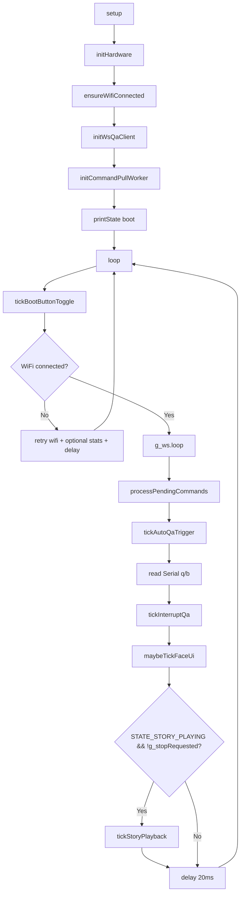
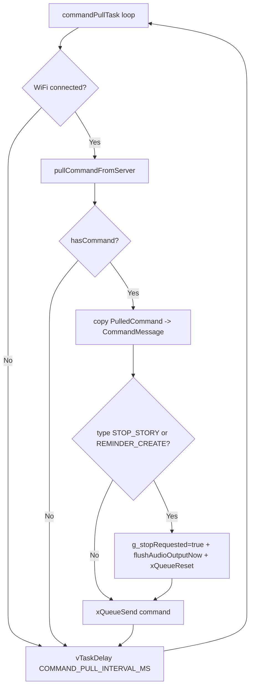
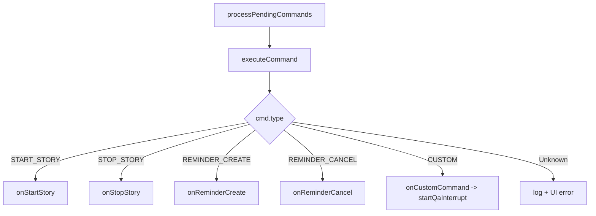
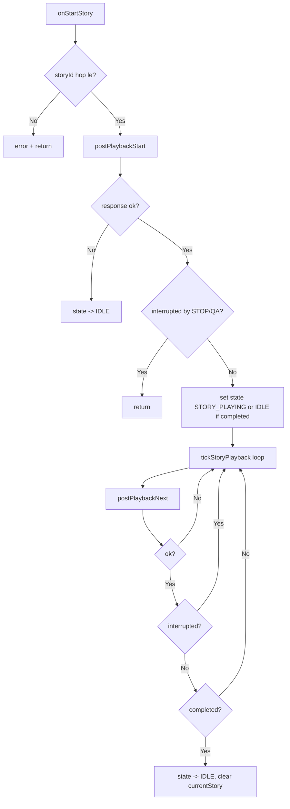
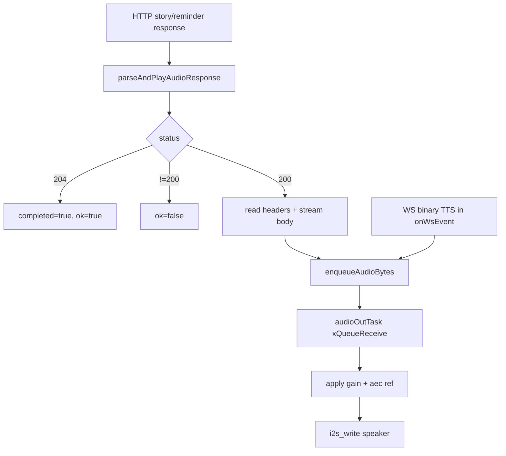
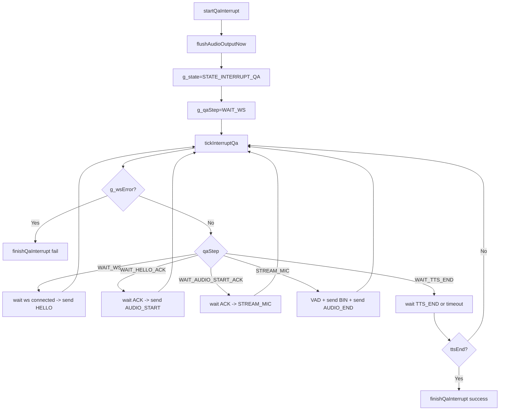
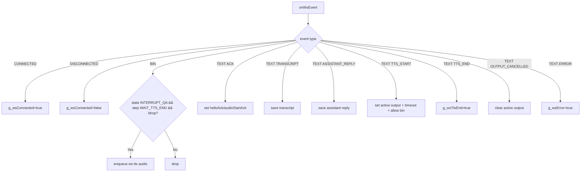
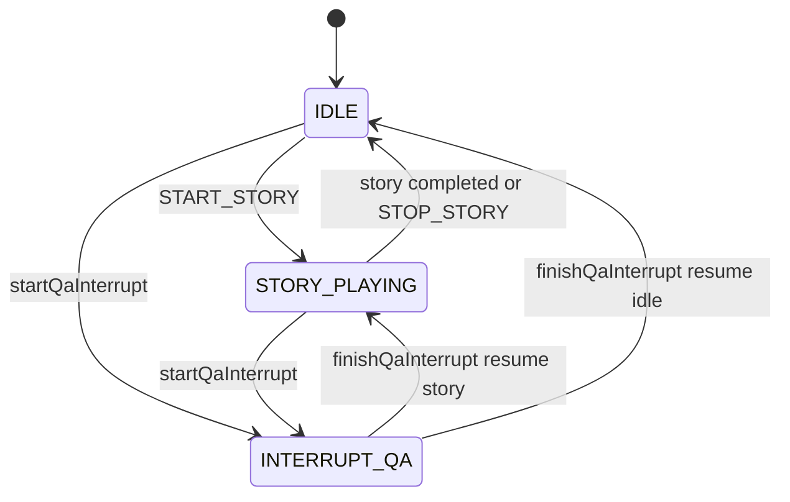

# Luu Do Rieng Cho `robot2QA.ino`

Tai lieu nay mo ta luong xu ly cua firmware `robot2QA.ino` theo dung state va ham trong code.

## 1) Luu do tong quan chuong trinh

## 2) Luong polling command (task nen)

## 3) Luong xu ly command

## 4) Luong doc truyen (START_STORY + NEXT)

## 5) Audio output pipeline (HTTP/WS -> Queue -> I2S)

## 6) QA interrupt state machine

## 7) WS event xu ly trong QA

## 8) State machine chinh

