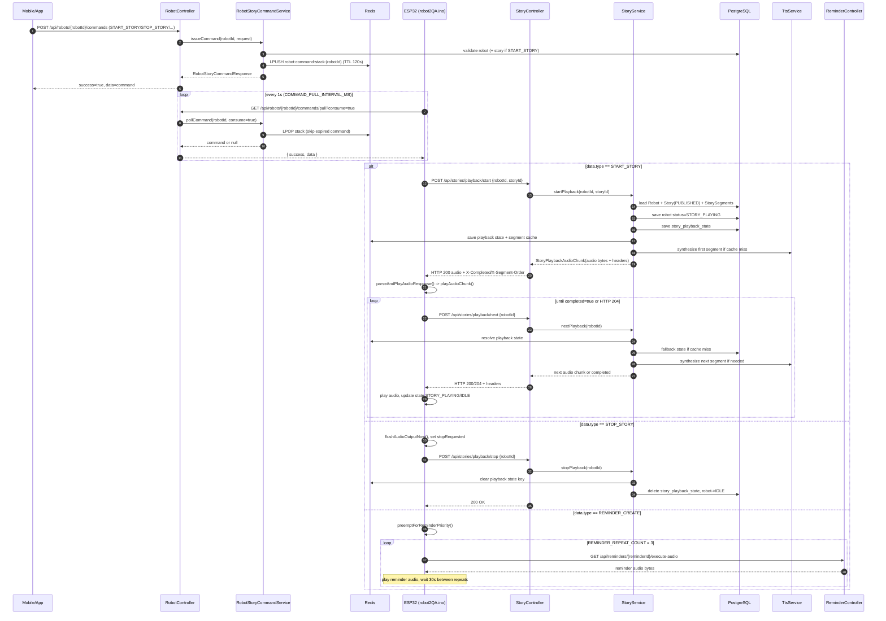
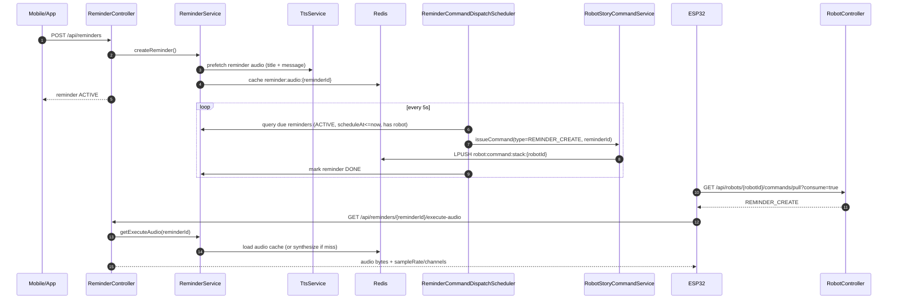
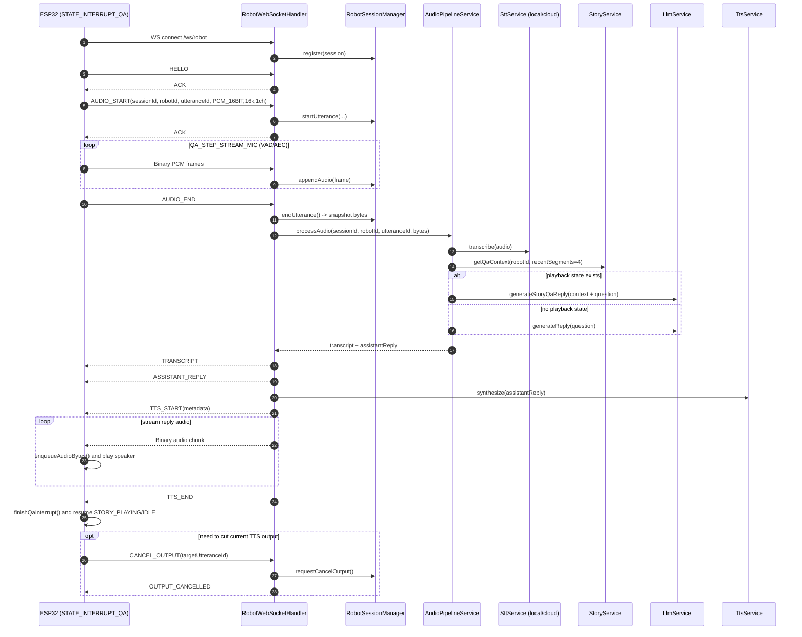

# Sequence Flow: `robot2QA.ino` <-> Backend

## 1) Command Polling + Story Playback

## 2) Reminder Dispatch (Backend Scheduler -> Robot)

## 3) QA Interrupt via WebSocket `/ws/robot`

## 4) Notes matched to code

- Firmware command pull: `pullCommandFromServer()` -> `GET /api/robots/{robotId}/commands/pull?consume=true`.
- Story playback APIs: `POST /api/stories/playback/start|next|stop`.
- Reminder audio used by firmware: `GET /api/reminders/{reminderId}/execute-audio`.
- QA WS event chain: `HELLO -> AUDIO_START -> (BIN)* -> AUDIO_END -> TRANSCRIPT/ASSISTANT_REPLY -> TTS_START -> (BIN)* -> TTS_END`.
