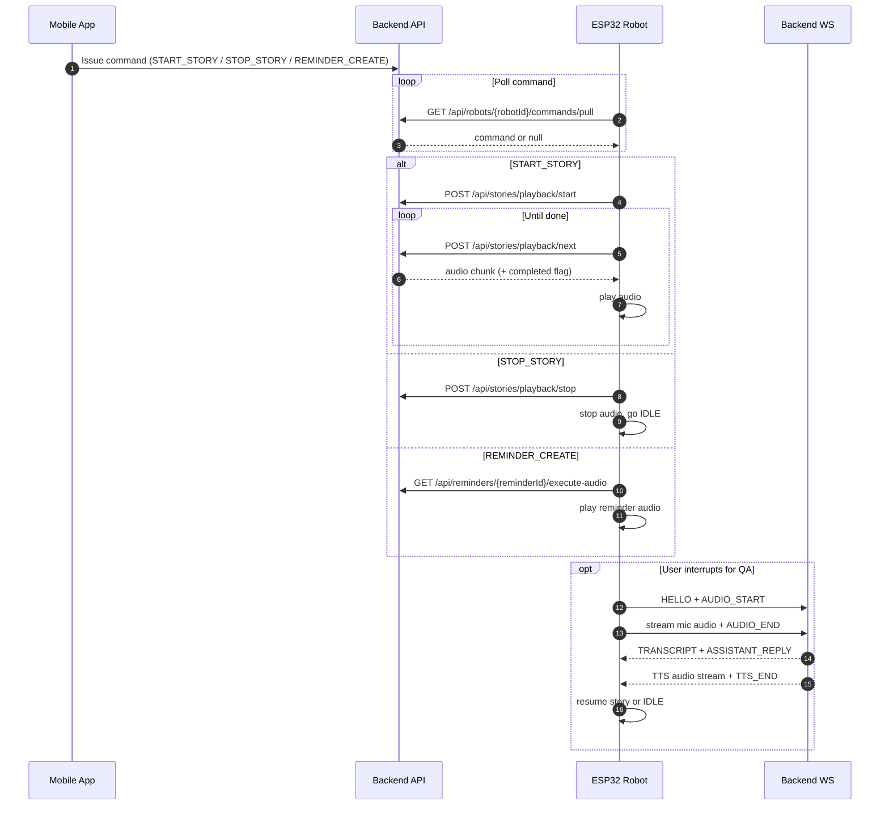

# Simple Sequence: Robot <-> Backend

```mermaid
sequenceDiagram
    autonumber
    participant App as Mobile App
    participant BE as Backend API
    participant ESP as ESP32 Robot
    participant WS as Backend WS

    App->>BE: Issue command (START_STORY / STOP_STORY / REMINDER_CREATE)
    loop Poll command
        ESP->>BE: GET /api/robots/{robotId}/commands/pull
        BE-->>ESP: command or null
    end

    alt START_STORY
        ESP->>BE: POST /api/stories/playback/start
        loop Until done
            ESP->>BE: POST /api/stories/playback/next
            BE-->>ESP: audio chunk (+ completed flag)
            ESP->>ESP: play audio
        end
    else STOP_STORY
        ESP->>BE: POST /api/stories/playback/stop
        ESP->>ESP: stop audio, go IDLE
    else REMINDER_CREATE
        ESP->>BE: GET /api/reminders/{reminderId}/execute-audio
        ESP->>ESP: play reminder audio
    end

    opt User interrupts for QA
        ESP->>WS: HELLO + AUDIO_START
        ESP->>WS: stream mic audio + AUDIO_END
        WS-->>ESP: TRANSCRIPT + ASSISTANT_REPLY
        WS-->>ESP: TTS audio stream + TTS_END
        ESP->>ESP: resume story or IDLE
    end
```
