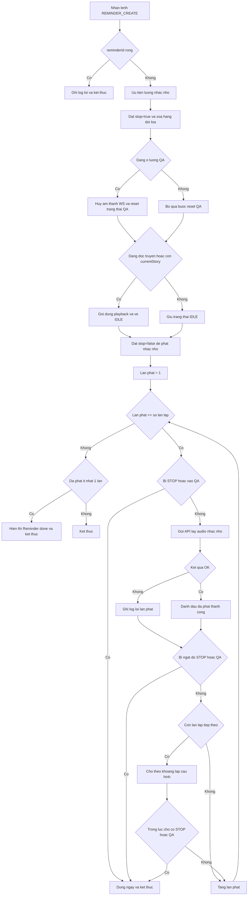
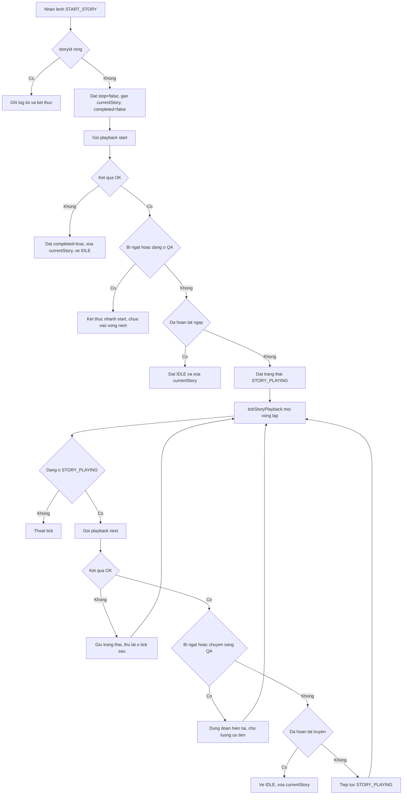
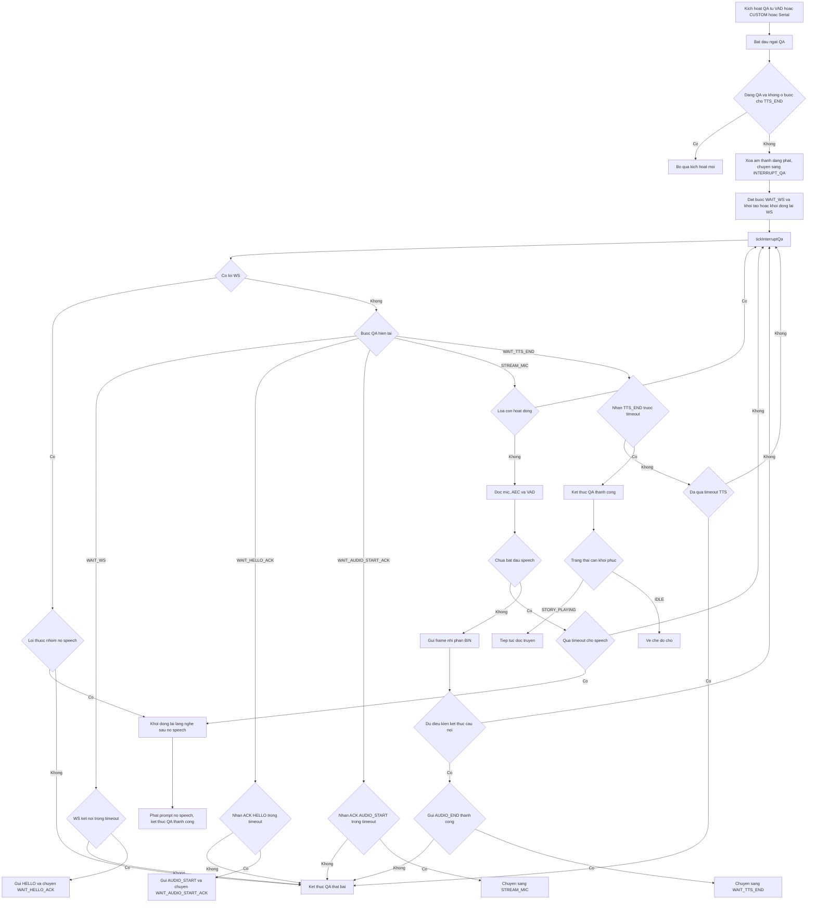

# Luu Do Thuat Toan - 3 Luong Chinh

## 1) Luong tao nhac nho

```mermaid
flowchart TD
    A["Nhan lenh REMINDER_CREATE"] --> B{"reminderId rong"}
    B -- Co --> C["Ghi log loi va ket thuc"]
    B -- Khong --> D["Uu tien luong nhac nho"]
    D --> E["Dat stop=true va xoa hang doi loa"]
    E --> F{"Dang o luong QA"}
    F -- Co --> G["Huy am thanh WS va reset trang thai QA"]
    F -- Khong --> H["Bo qua buoc reset QA"]
    G --> I{"Dang doc truyen hoac con currentStory"}
    H --> I
    I -- Co --> J["Goi dung playback va ve IDLE"]
    I -- Khong --> K["Giu trang thai IDLE"]
    J --> L["Dat stop=false de phat nhac nho"]
    K --> L

    L --> M["Lan phat = 1"]
    M --> N{"Lan phat <= so lan lap"}
    N -- Khong --> O{"Da phat it nhat 1 lan"}
    O -- Co --> P["Hien thi Reminder done va ket thuc"]
    O -- Khong --> Q["Ket thuc"]

    N -- Co --> R{"Bi STOP hoac vao QA"}
    R -- Co --> S["Dung ngay va ket thuc"]
    R -- Khong --> T["Goi API lay audio nhac nho"]
    T --> U{"Ket qua OK"}
    U -- Khong --> V["Ghi log loi lan phat"]
    U -- Co --> W["Danh dau da phat thanh cong"]
    V --> X{"Bi ngat do STOP hoac QA"}
    W --> X
    X -- Co --> S
    X -- Khong --> Y{"Con lan lap tiep theo"}
    Y -- Khong --> Z["Tang lan phat"]
    Y -- Co --> AA["Cho theo khoang lap cau hinh"]
    AA --> AB{"Trong luc cho co STOP hoac QA"}
    AB -- Co --> S
    AB -- Khong --> Z["Tang lan phat"]
    Z --> N
```

## 2) Luong doc truyen

```mermaid
flowchart TD
    A["Nhan lenh START_STORY"] --> B{"storyId rong"}
    B -- Co --> C["Ghi log loi va ket thuc"]
    B -- Khong --> D["Dat stop=false, gan currentStory, completed=false"]
    D --> E["Goi playback start"]
    E --> F{"Ket qua OK"}
    F -- Khong --> G["Dat completed=true, xoa currentStory, ve IDLE"]
    F -- Co --> H{"Bi ngat hoac dang o QA"}
    H -- Co --> I["Ket thuc nhanh start, chua vao vong next"]
    H -- Khong --> J{"Da hoan tat ngay"}
    J -- Co --> K["Dat IDLE va xoa currentStory"]
    J -- Khong --> L["Dat trang thai STORY_PLAYING"]

    L --> M["tickStoryPlayback moi vong lap"]
    M --> N{"Dang o STORY_PLAYING"}
    N -- Khong --> O["Thoat tick"]
    N -- Co --> P["Goi playback next"]
    P --> Q{"Ket qua OK"}
    Q -- Khong --> R["Giu trang thai, thu lai o tick sau"]
    R --> M
    Q -- Co --> S{"Bi ngat hoac chuyen sang QA"}
    S -- Co --> T["Dung doan hien tai, cho luong uu tien"]
    T --> M
    S -- Khong --> U{"Da hoan tat truyen"}
    U -- Co --> V["Ve IDLE, xoa currentStory"]
    U -- Khong --> W["Tiep tuc STORY_PLAYING"]
    W --> M
```

## 3) Luong hoi thoai va QA

```mermaid
flowchart TD
    A["Kich hoat QA tu VAD hoac CUSTOM hoac Serial"] --> B["Bat dau ngat QA"]
    B --> C{"Dang QA va khong o buoc cho TTS_END"}
    C -- Co --> D["Bo qua kich hoat moi"]
    C -- Khong --> E["Xoa am thanh dang phat, chuyen sang INTERRUPT_QA"]
    E --> F["Dat buoc WAIT_WS va khoi tao hoac khoi dong lai WS"]

    F --> G["tickInterruptQa"]
    G --> H{"Co loi WS"}
    H -- Co --> I{"Loi thuoc nhom no speech"}
    I -- Co --> J["Khoi dong lai lang nghe sau no speech"]
    J --> K["Phat prompt no speech, ket thuc QA thanh cong"]
    I -- Khong --> L["Ket thuc QA that bai"]

    H -- Khong --> M{"Buoc QA hien tai"}
    M -- WAIT_WS --> N{"WS ket noi trong timeout"}
    N -- Khong --> L
    N -- Co --> O["Gui HELLO va chuyen WAIT_HELLO_ACK"]

    M -- WAIT_HELLO_ACK --> P{"Nhan ACK HELLO trong timeout"}
    P -- Khong --> L
    P -- Co --> Q["Gui AUDIO_START va chuyen WAIT_AUDIO_START_ACK"]

    M -- WAIT_AUDIO_START_ACK --> R{"Nhan ACK AUDIO_START trong timeout"}
    R -- Khong --> L
    R -- Co --> S["Chuyen sang STREAM_MIC"]

    M -- STREAM_MIC --> T{"Loa con hoat dong"}
    T -- Co --> G
    T -- Khong --> U["Doc mic, AEC va VAD"]
    U --> V{"Chua bat dau speech"}
    V -- Co --> W{"Qua timeout cho speech"}
    W -- Co --> J
    W -- Khong --> G
    V -- Khong --> X["Gui frame nhi phan BIN"]
    X --> Y{"Du dieu kien ket thuc cau noi"}
    Y -- Khong --> G
    Y -- Co --> Z{"Gui AUDIO_END thanh cong"}
    Z -- Khong --> L
    Z -- Co --> AA["Chuyen sang WAIT_TTS_END"]

    M -- WAIT_TTS_END --> AB{"Nhan TTS_END truoc timeout"}
    AB -- Khong --> AC{"Da qua timeout TTS"}
    AC -- Co --> L
    AC -- Khong --> G
    AB -- Co --> AD["Ket thuc QA thanh cong"]

    AD --> AE{"Trang thai can khoi phuc"}
    AE -- STORY_PLAYING --> AF["Tiep tuc doc truyen"]
    AE -- IDLE --> AG["Ve che do cho"]
```
